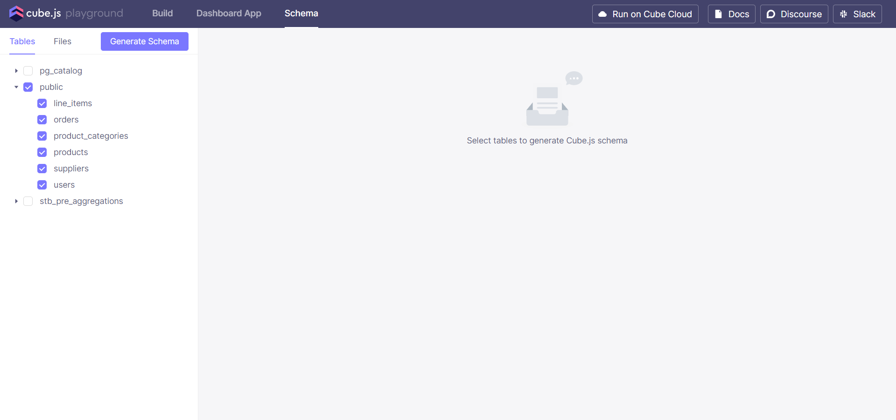
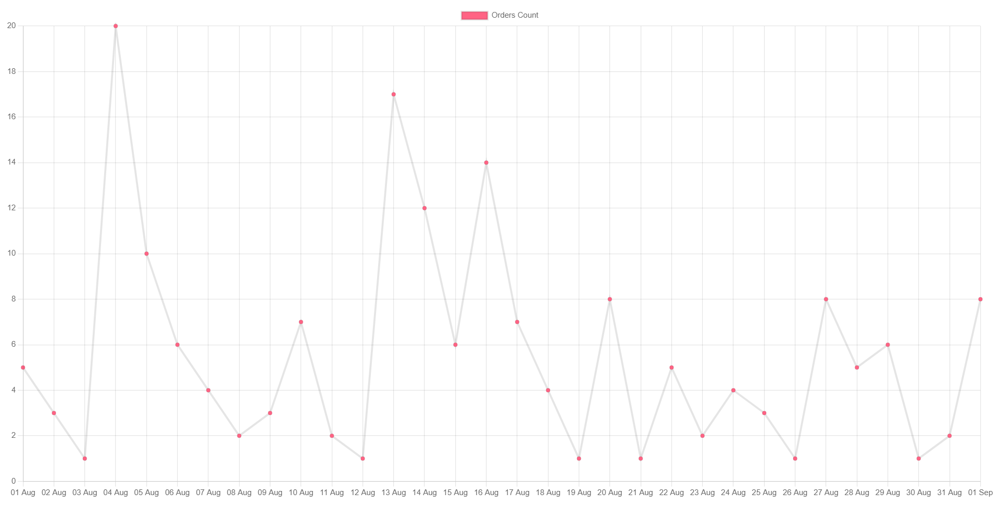
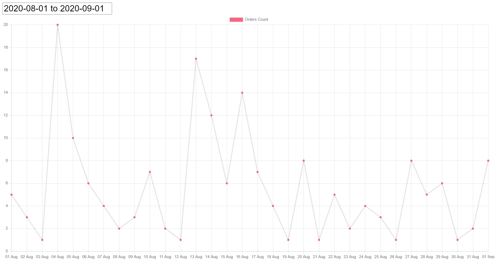
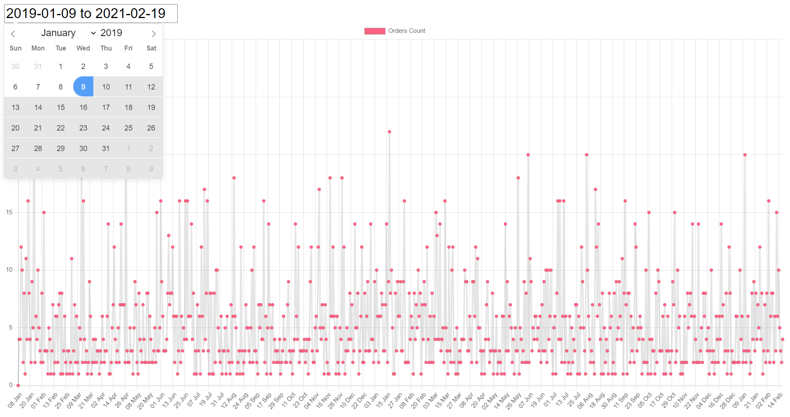
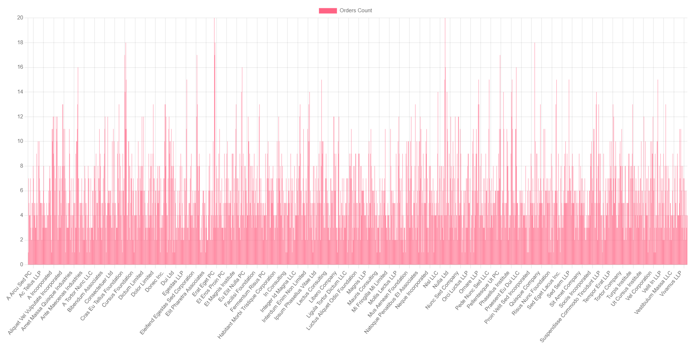
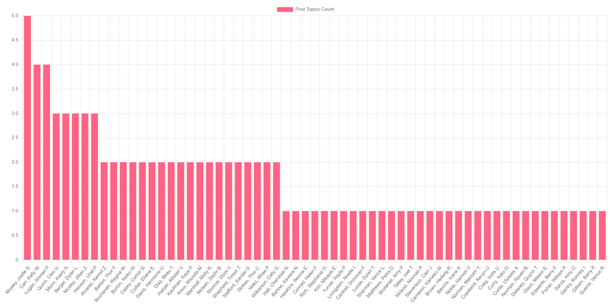
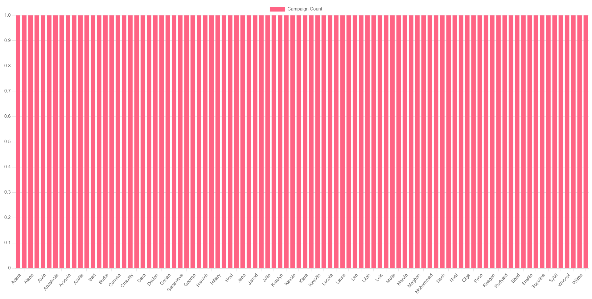

# **Working with Joins**

In this tutorial we are going to explore different types of relations between tables in a database and
observe different types of charts with ChartJS.

## **Prerequisites**

-  Docker
-  Docker Compose
-  Node
-  Database (we will use PostgreSQL) with sample data
-  Cube.js backend to handle communications between database and frontend
-  Chart.js to generate charts and graphs.
-  Frontend application (we will build one with HTML/CSS)
-  Must have knowledge of generating charts/graphs with Chart.js

## **Overview**

To get this demo you will need to have Node and npm installed on your machine. The instructions to setup Node and npm can be found online.


## **Implementation**

1. Clone the repository & open the repository root directory in terminal.

2. Run the below command to install cubejs-cli

```
npm -g install cubejs-cli
```

3. Next run the below npm command to install the dependencies listed in the package.json file

```
npm install
```

4. Current configurations are set to support postgres database defined in docker-compose.yml. Now to run the Docker with Cube.js and Postgres database. Run the following commnand

```
docker compose up -d
```
5. For data in our database, run the following command to dump the data in the database.

```
docker exec postgres bash -c "psql --db ecom -f ecom-dump.sql -U postgres"
```
6. Goto http://localhost:4000. We can see data in our database. Now, we can generate schema for our data.



7. To observe a graph/chart generated from static data. We will comment out the following code in the *.src/index.js* file.

```
cubejsApi
  .load({
    measures: ["Orders.count"],
    timeDimensions: [
      {
        dimension: "Orders.createdAt",
        granularity: `day`,
        dateRange: [`08/01/2020`, `09/01/2020`],
      },
    ],
  })
  .then((resultSet) => {
    new Chart(document.getElementById("chart"), {
      type: "line",
      options: {},
      data: chartJsData(resultSet),
    });
  });
```
The following code will be commented in *.src/index.js* file.

```
let chart;

var drawChart = function (startDate, endDate) {
    cubejsApi
        .load({
            measures: ["Orders.count"],
            timeDimensions: [
                {
                    dimension: "Orders.createdAt",
                    granularity: `day`,
                    dateRange: [startDate, endDate],
                },
            ],
        })
        .then((resultSet) => {
            if (chart) {
                chart.data = chartJsData(resultSet);
                chart.update();
            } 
            else {
                chart = new Chart(document.getElementById("chart"), {type: "line",options: {},data: chartJsData(resultSet),});
            }
        });
};
const MIN_DATE = "2020-08-01";
const MAX_DATE = "2020-09-01";

flatpickr("#dates", {
    mode: "range",
    dateFormat: "Y-m-d",
    defaultDate: [MIN_DATE, MAX_DATE],

    onChange: function (selectedDates) {
        if (selectedDates.length === 2) {
            drawChart(selectedDates[0], selectedDates[1]);
        }
    },
});

drawChart(MIN_DATE, MAX_DATE);
```

8. Now, for our frontend, goto http://localhost:1235. Our server is running in a dockor container. We will see a static graph generated from static data.



9. We can observe charts/graphs created dynamically from dynamic data. For this, comment out the following code in *.src/index.js* file.

```
let chart;

var drawChart = function (startDate, endDate) {
    cubejsApi
        .load({
            measures: ["Orders.count"],
            timeDimensions: [
                {
                    dimension: "Orders.createdAt",
                    granularity: `day`,
                    dateRange: [startDate, endDate],
                },
            ],
        })
        .then((resultSet) => {
            if (chart) {
                chart.data = chartJsData(resultSet);
                chart.update();
            } 
            else {
                chart = new Chart(document.getElementById("chart"), {type: "line",options: {},data: chartJsData(resultSet),});
            }
        });
};
const MIN_DATE = "2020-08-01";
const MAX_DATE = "2020-09-01";

flatpickr("#dates", {
    mode: "range",
    dateFormat: "Y-m-d",
    defaultDate: [MIN_DATE, MAX_DATE],

    onChange: function (selectedDates) {
        if (selectedDates.length === 2) {
            drawChart(selectedDates[0], selectedDates[1]);
        }
    },
});

drawChart(MIN_DATE, MAX_DATE);
```
The following code will be commented in *.src/index.js* file.

```
cubejsApi
  .load({
    measures: ["Orders.count"],
    timeDimensions: [
      {
        dimension: "Orders.createdAt",
        granularity: `day`,
        dateRange: [`08/01/2020`, `09/01/2020`],
      },
    ],
  })
  .then((resultSet) => {
    new Chart(document.getElementById("chart"), {
      type: "line",
      options: {},
      data: chartJsData(resultSet),
    });
  });
```

10. Now, goto http://localhost:1235. Our server is running in a dockor container. We will see a dynamic graph generated from dynamic data.



11. We can generate different graphs/chats dynamically by selecting different date. Then the graph will be generated dynamically from the data.



## **Working**

1. Our system works using docker containers. There are three containers:
	- Node
	- Cube
	- Postgres

2. Node container handles the frontend of the system. On system startup, it serves the frontend functionality of the system. Frontend includes the following files:
	- *.src/index.js*
	- *.src/styles.css*
	- *./index.html*
3. *.src/index.js* file handles the API calls from the backend. It sends and receives the data via API call from the backend. It dynamically generates charts/graphs using ChartJS from the received data from backend.
4. *.src/styles.css* handles the styling of our frontend. *./index.html* displays generated charts/graphs.
5. Cube container handles the requests between backend and frontend. It recevies requests from frontend or say Node container, then it sends resposes from backend or say Postgres conatiner based upon the requests.
6. Postgres container handles the database of the system. It is the backend of the system. It receives requests from Cube container and send responses to Cube based upon the requests.


# **Joins**

If we are familiar with the Cube.js playground, then we will have no problem further down the line.


A join creates a relationship between two cubes in your Cube project. Cube supports three kinds of relationships often found in SQL databases:
- hasOne
- hasMany
- belongsTo

For Example, we have two cubes *Users* and *Orders*. If we add a join to the users cube.

```
cube('Users', {
  ...,

  joins: {
    Orders: {
      relationship: `hasMany`,
      sql: `${CUBE}.id = ${Orders}.user_id`,
    },
  },
});
```
The above join means that a user has many orders. If we send a query such as:
```
{
  "dimensions": ["Orders.status", "Users.company"],
  "timeDimensions": [
    {
      "dimension": "Orders.createdAt"
    }
  ],
  "order": [["Users.company", "asc"]],
  "measures": ["Orders.count"]
}
```
The SQL query generated from the above JSON query is:
```
SELECT
  "orders".status "orders_status",
  "users".company "users_company",
  count("orders".id) "orders_count"
FROM
  public.users AS "users"
  LEFT JOIN public.orders AS "orders" ON "users".id = "orders".user_id
GROUP BY
  1,
  2
ORDER BY
  2 ASC
LIMIT
  10000
```
We create a bar chart from the data we receive will be shown as:



What if a user places order and that user is not registered and order is placed anonymously. We we do? To remedy this, we'll remove the join from the Users cube and instead define a join with a belongsTo relationship on the Orders cube:

```
cube('Orders', {
  ...,

  joins: {
    Users: {
      relationship: `belongsTo`,
      sql: `${CUBE}.user_id = ${Users}.id`,
    },
  },
});
```

In the above schema, our Orders cube defines the relationship between itself and the User cube. The same JSON query now results in the following SQL query:

```
SELECT
  "orders".status "orders_status",
  "users".company "users_company",
  count("orders".id) "orders_count"
FROM
  public.orders AS "orders"
  LEFT JOIN public.users AS "customers" ON "orders".customer_id = "customers".id
GROUP BY
  1,
  2
ORDER BY
  2 ASC
LIMIT
  10000
```

As we can see, the base table in the query is orders, and users is in the LEFT JOIN clause; this means any orders without a user will also be retrieved.

>In Cube, joins only need to be defined from one direction. In the above example, we explicitly removed the hasMany relationship from the User cube; not doing so would cause the query to fail as Cube would be unable to determine a valid join path. 

## **Many-to-Many Joins**

A many-to-many relationship occurs when multiple records in a cube are associated with multiple records in another cube.

For example, let's say we have two cubes, Topics and Posts, pointing to the topics and posts tables in our database respectively. A Post can have more than one Topic, and a Topic may have more than one Post.

In a database, you would most likely have an associative table (also known as a junction table or cross-reference table). In our example, this table name might be post_topics.

In the same way the post_topics table was specifically created to handle this association in the database, we need to create an associative cube PostTopics, and declare the relationships from it to Topics cube and from Posts to PostTopics.

The following example uses the hasMany relationship on the PostTopics cube; this causes the direction of joins to be Posts -> PostTopics -> Topics.

~~~
cube(`Posts`, {
  sql: `SELECT * FROM posts`,

  joins: {
    PostTopics: {
      relationship: `belongsTo`,
      sql: `${PostTopics}.post_id = ${Posts}.id`,
    },
  },
});

cube(`Topics`, {
  sql: `SELECT * FROM topics`,
});

cube(`PostTopics`, {
  sql: `SELECT * FROM post_topics`,

  joins: {
    Topic: {
      relationship: `hasMany`,
      sql: `${PostTopics}.topic_id = ${Topics}.id`,
    },
  },
});
~~~

In scenarios where a table doesn't define a primary key, one can be generated using SQL:

```
cube(`PostTopics`, {
  dimensions: {
    id: {
      sql: `CONCAT(${CUBE}.post_id, ${CUBE}.topic_id)`,
      type: `number`,
      primaryKey: true,
    },
  },
});
```
After setting up our database and schema, let's create a chart to observe the reltaion between tables.

Lets send the  following query.

```
 measures: ["PostTopics.count"],
    timeDimensions: [],
    order: {
      "PostTopics.count": "desc",
    },
    filters: [],
    dimensions: ["Topics.topics"],
```




## **Many-to-many joins without an associative table**

Sometimes there is no associative table in the database, when in reality, there is a many-to-many relationship. In this case, the solution is to extract some data from existing tables and create a virtual (not backed by a real table in the database) associative cube.

Let’s consider the following example. We have tables Emails and Transactions. The goal is to calculate the amount of transactions per campaign. Both Emails and Transactions have a campaign_id column. We don’t have a campaigns table, but data about campaigns is part of the Emails table.

Heres the Emails Cube definition.

```
cube(`Emails`, {
  sql: `SELECT * FROM emails`,

  measures: {
    count: {
      type: `count`,
    },
  },

  dimensions: {
    id: {
      sql: `id`,
      type: `number`,
      primaryKey: true,
    },

    campaignName: {
      sql: `campaign_name`,
      type: `string`,
    },

    campaignId: {
      sql: `campaign_id`,
      type: `number`,
    },
  },
});
```
We will create a Campaigns Cube. The definition is follow:
```
cube(`Campaigns`, {
  sql: `
SELECT
  campaign_id,
  campaign_name,
FROM emails
`,

  measures: {
    count: {
      type: `count`,
    },
  },

  dimensions: {
    id: {
      sql: `campaign_id`,
      type: `string`,
      primaryKey: true,
    },

    name: {
      sql: `campaign_name`,
      type: `string`,
    },
  },
});
```
Now, lets declare a many-to-many relationship. This should be done by declaring a hasMany relationship on the associative cube, Campaigns in our case.
```
cube(`Emails`, {
  sql: `select * emails`,

  joins: {
    Campaigns: {
      relationship: `belongsTo`,
      sql: `${CUBE}.campaign_id = ${Campaigns}.campaign_id
      AND ${CUBE}.campaign_name = ${Campaigns}.campaign_name`,
    },
  },
 });
 
 cube(`Campaigns`, {
  joins: {
    Transactions: {
      relationship: `hasMany`,
      sql: `${CUBE}.campaign_name = ${Campaigns}.campaign_name
      AND ${CUBE}.campaign_id = ${Campaigns}.campaign_id`,
    },
  },
});
 
```

Let's create a chart to see if it works or not



## **Directions of Joins**

The direction of joins greatly influences the final result set. 
As, we have seen start in the start that direction of join greatly affects the result.

with the query 
```

SELECT
  "orders".status "orders_status",
  "users".company "users_company",
  count("orders".id) "orders_count"
FROM
  public.users AS "users"
  LEFT JOIN public.orders AS "orders" ON "users".id = "orders".user_id
GROUP BY
  1,
  2
ORDER BY
  2 ASC
LIMIT
  10000
```

we can only see orders with registered users
but, to see orders by the anonymous/guests we have to change the query and relationship

```
SELECT
  "orders".status "orders_status",
  "users".company "users_company",
  count("orders".id) "orders_count"
FROM
  public.orders AS "orders"
  LEFT JOIN public.users AS "users" ON "orders".user_id = "users".id
GROUP BY
  1,
  2
ORDER BY
  2 ASC
LIMIT
  10000
```

This way we can see the orders by anonymous/guests users.

## **Transitive join pitfalls**
> Transitive law is “If a is equal to b and b is equal to c, then a is equal to c.”
If one 'table a' has relation 'table b', and 'table b' has relation with 'table c', 
then 'table a' has realtion with 'table c'

Lets consider an example of users and organization-users we will create cubes of users and 
organization-users

Lets just say, our database is setup and we send this query

```
{
  "measures": ["Users.count"],
  "dimensions": ["Organizations.name"]
}
```
After running this query, we will get an error

`Error: Can't find join path to join 'Users','Organizations'. `

The problem is that joins are directed and if we try to 
connect Users and Organizations there's no path from Users to Organizations or 
either from Organizations to Users. 
One possible solution is to move the Users-OrganizationUsers join from OrganizationUsers 
cube to Users, although this affects the query semantics and thus the final results varies.

After rearranging the realtionship, if we run the above query again then it will work.
So, the realtion between tables matter for transitive joins.

## **Conclusion**

If you’ve followed the above steps, then you’ve now created, configured, and started a Dynamic Graph/Chart generator using ChartJs and you have explored the different types of realtions between database tables and how to manage relationships between tables and you’re well on your way to taking full advantage of ChartJs as a solution to a variety of Grpahs/Charts needs and managing relationships in the database.
