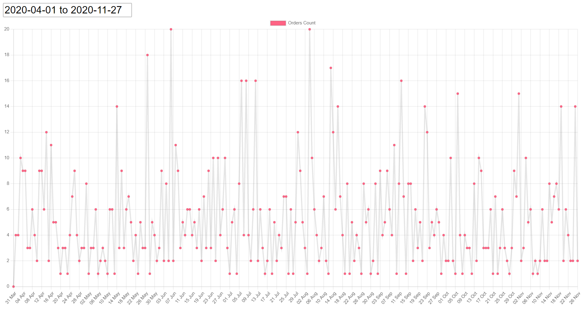

# **ChartJS wirh dynamic dataset**

In this tutorial we are going to build a dynamic graph/chart generator based o data with ChartJS.

## **Prerequisites**

-  Docker
-  Docker Compose
-  Node
-  Database (we will use PostgreSQL) with sample data
-  Cube.js backend to handle communications between database and frontend
-   Chart.js to generate charts and graphs.
-  Frontend application (we will build one with HTML/CSS)

## **Overview**

To get this demo you will need to have Node and npm installed on your machine. The instructions to setup Node and npm can be found online.



## **Implementation**

1. Clone the repository & open the repository root directory in terminal.

2. Run the below command to install cubejs-cli

```
npm -g install cubejs-cli
```

3. Next run the below npm command to install the dependencies listed in the package.json file

```
npm install
```

4. Current configurations are set to support postgres database defined in docker-compose.yml. Now to run the Docker with Cube.js and Postgres database. Run the following commnand

```
docker compose up -d
```
5. For data in our database, run the following command to dump the data in the database.

```
docker exec postgres bash -c "psql --db ecom -f ecom-dump.sql -U postgres"
```
6. We can see data in our database. Now, we can generate schema for our data.


7. Now, for our frontend, goto http://localhost:1235. Our server is running in a dockor container. We will see a graph with dynamic data.


## **Conclusion**

If you’ve followed the above steps, then you’ve now created, configured, and started a Dynamic Graph/Chart generator using ChartJs and you’re well on your way to taking full advantage of ChartJs as a solution to a variety of Grpahs/Charts needs.